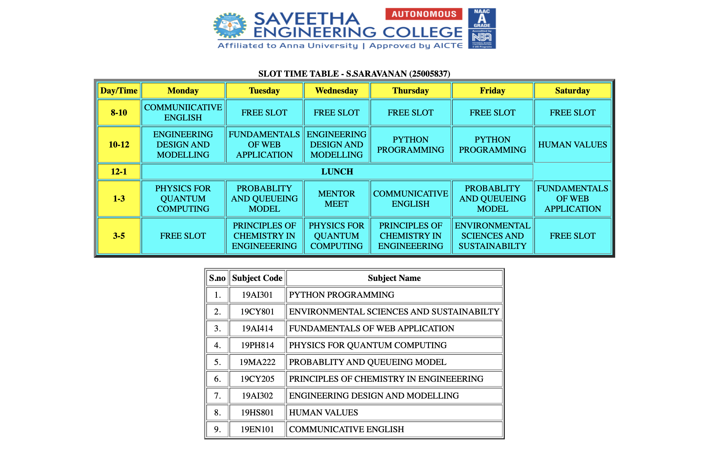

# Ex03 Time Table
# Date: 01.10.2025
# AIM
To write a html webpage page to display your slot timetable.

# ALGORITHM
## STEP 1
Create a Django-admin Interface.

## STEP 2
Create a static folder and inert HTML code.

## STEP 3
Create a simple table using `<table>` tag in html.

## STEP 4
Add header row using `<th>` tag.

## STEP 5
Add your timetable using `<td>` tag.

## STEP 6
Execute the program using runserver command.

# PROGRAM
```<!DOCTYPE html>
<html>
    <head>
    <title>Slot Timetable</title>
    </head>
    <body>
        <center>
            
        </center>
        <br>
        <table align="center" width="540" cellspacing="2" cellpadding="4" border="5" bgcolor="cyan">
            <caption><b>SLOT TIME TABLE - S.SARAVANAN (25005837)</b></caption>
            <tr align="center">
                <th bgcolor="yellow">Day/Time</th>
                <th bgcolor="yellow">Monday</th>
                <th bgcolor="yellow">Tuesday</th>
                <th bgcolor="yellow">Wednesday</th>
                <th bgcolor="yellow">Thursday</th>
                <th bgcolor="yellow">Friday</th>
                <th bgcolor="yellow">Saturday</th>
            </tr>
            <tr align="center">
                <th bgcolor="yellow">8-10</th>
                <td>COMMUNIICATIVE ENGLISH</td>
                <td>FREE SLOT</td>
                <td>FREE SLOT</td>
                <td>FREE SLOT</td>
                <td>FREE SLOT</td>
                <td>FREE SLOT</td>
            </tr>
            <tr align="center">
                <th bgcolor="yellow">10-12</th>
                <td>ENGINEERING DESIGN AND MODELLING</td>
                <td>FUNDAMENTALS OF WEB APPLICATION</td>
                <td>ENGINEERING DESIGN AND MODELLING</td>
                <td>PYTHON PROGRAMMING</td>
                <td>PYTHON PROGRAMMING</td>
                <td>HUMAN VALUES</td>
            </tr>
            <tr align="center">
                <th bgcolor="yellow">12-1</th>
                <th colspan="5" align="center"><b>LUNCH</b></th>
            </tr>
            <tr align="center">
                <th bgcolor="yellow">1-3</th>
                <td>PHYSICS FOR QUANTUM COMPUTING</td>
                <td>PROBABLITY AND QUEUEING MODEL</td>
                <td>MENTOR MEET</td>
                <td>COMMUNICATIVE ENGLISH</td>
                <td>PROBABLITY AND QUEUEING MODEL</td>
                <td>FUNDAMENTALS OF WEB APPLICATION</td>
            </tr>
            <tr align="center">
                <th bgcolor="yellow">3-5</th>
                <td>FREE SLOT</td>
                <td>PRINCIPLES OF CHEMISTRY IN ENGINEEERING</td>
                <td>PHYSICS FOR QUANTUM COMPUTING</td>
                <td>PRINCIPLES OF CHEMISTRY IN ENGINEEERING</td>
                <td>ENVIRONMENTAL SCIENCES AND SUSTAINABILTY</td>
                <td>FREE SLOT</td>
            </tr>
        </table>
        <br>
        <table align="center" cellspacing="2" cellpadding="4" border="2">
            <tr align="center">
                <th>S.no</th>
                <th>Subject Code</th>
                <th>Subject Name</th>
            </tr>
            <tr>
                <td align="center">1.</td>
                <td align="center">19AI301</td>
                <td>PYTHON PROGRAMMING</td>
            </tr>
            <tr>
                <td align="center">2.</td>
                <td align="center">19CY801</td>
                <td>ENVIRONMENTAL SCIENCES AND SUSTAINABILTY</td>
            </tr>
            <tr>
                <td align="center">3.</td>
                <td align="center">19AI414</td>
                <td>FUNDAMENTALS OF WEB APPLICATION</td>
            </tr>
            <tr>
                <td align="center">4.</td>
                <td align="center">19PH814</td>
                <td>PHYSICS FOR QUANTUM COMPUTING</td>
            </tr>
            <tr>
                <td align="center">5.</td>
                <td align="center">19MA222</td>
                <td>PROBABLITY AND QUEUEING MODEL</td>
            </tr>
            <tr>
                <td align="center">6.</td>
                <td align="center">19CY205</td>
                <td>PRINCIPLES OF CHEMISTRY IN ENGINEEERING</td>
            </tr>
            <tr>
                <td align="center">7.</td>
                <td align="center">19AI302</td>
                <td>ENGINEERING DESIGN AND MODELLING</td>
            </tr>
            <tr>
                <td align="center">8.</td>
                <td align="center">19HS801</td>
                <td>HUMAN VALUES</td>
            <tr>
                <td align="center">9.</td>
                <td align="center">19EN101</td>
                <td>COMMUNICATIVE ENGLISH</td>    
            </tr>
        </table>
    </body>
</html>
```

# OUTPUT

# RESULT
The program for creating slot timetable using basic HTML tags is executed successfully.
